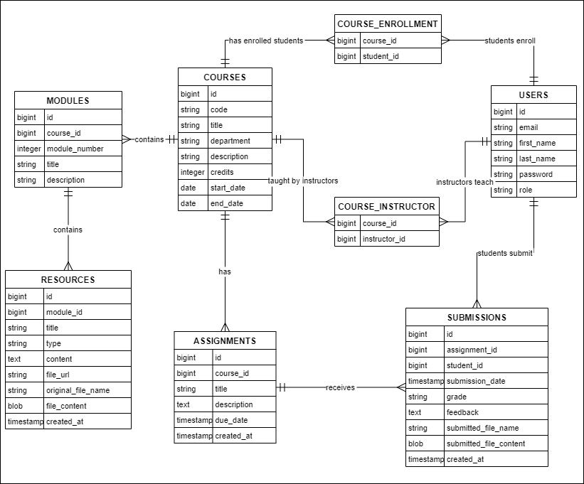

# StudyHub Backend


[//]: # (![License]&#40;https://img.shields.io/badge/License-MIT-yellow&#41;)

StudyHub is a collaborative full-stack Learning Management System (LMS)
developed as a group project for the APP2000 course at the University of South-Eastern Norway.  
In this project, our team of students attempt to create a robust platform for managing users,
courses, modules, resources, assignments, and submissions.  
Our efforts in this repository focus on designing a REST API backend using Spring Boot,
integrated with a PostgreSQL database, and to support a frontend client.

The repository serves as the central hub for our group’s work,
documenting the project setup, API specifications, and usage examples.  
It reflects our teamwork and contributions.

## Table of Contents
- [Package Layout](#package-layout)
- [Project Setup Instructions](#project-setup-instructions)
    - [Prerequisites](#prerequisites)
    - [Local Setup](#local-setup)
    - [Database Seeding](#database-seeding)
- [API Documentation](#api-documentation)
    - [User Controller](#user-controller-apiusers)
    - [Course Controller](#course-controller-apicourses)
    - [Assignment Controller](#assignment-controller-apicoursescourseidassignments)
    - [Module Controller](#module-controller-apicoursescourseidmodules)
    - [Resource Controller](#resource-controller-apimodulesmoduleidresources)
    - [Submission Controller](#submission-controller-apicoursescourseidsubmissions)
- [API Usage Examples](#api-usage-examples)
    - [Using Postman](#using-postman)
        - [User Controller](#user-controller)
        - [Course Controller](#course-controller)
        - [Assignment Controller](#assignment-controller)
        - [Module Controller](#module-controller)
        - [Resource Controller](#resource-controller)
        - [Submission Controller](#submission-controller)
    - [Using Swagger UI](#using-swagger-ui)
- [Entity Relationship Diagram](#entity-relationship-diagram)

## Package Layout
```
studyhub-backend/
├── src/
│   ├── main/
│   │   ├── java/
│   │   │   ├── com/studyhub/
│   │   │   │   ├── config/
│   │   │   │   ├── constant/
│   │   │   │   ├── controller/
│   │   │   │   ├── dto/
│   │   │   │   │   ├── assignment/
│   │   │   │   │   ├── course/
│   │   │   │   │   ├── module/
│   │   │   │   │   ├── resource/
│   │   │   │   │   ├── submission/
│   │   │   │   │   ├── user/
│   │   │   │   ├── exception/
│   │   │   │   ├── mapper/
│   │   │   │   ├── model/
│   │   │   │   ├── repository/
│   │   │   │   ├── service/
│   │   │   │   ├── StudyhubBackendApplication.java
│   │   ├── resources/
│   │   │   ├── application.properties
│   │   │   ├── data.sql
├── pom.xml
└── README.md
```

## Project Setup Instructions

### Prerequisites
- Java 21
- Maven 3.8+
- PostgreSQL 16.4+

### Local Setup

#### 1. Clone the Project
- **Option 1: Download ZIP**
    - Download the project as a `.zip` file and extract it to a directory (e.g., `studyhub-backend`).
- **Option 2: Clone via Terminal**
    - Open a terminal and run:
      ```bash
      git clone https://github.com/Lidizz/studyhub-backend.git
      ```
    - Navigate to the project folder:
      ```bash
      cd studyhub-backend
      ```
- **Option 3: Clone via IDE**
    - In your IDE (e.g., IntelliJ IDEA or VS Code):
        1. Go to `File > New > Project from Version Control` (or equivalent).
        2. Enter the URL: `https://github.com/Lidizz/studyhub-backend.git`.
        3. Clone and open the project.

#### 2. Configure PostgreSQL
- **Create the Database:**
    - **Using pgAdmin:**
        1. Open pgAdmin and connect to your PostgreSQL server.
        2. Right-click "Databases" and select "Create" → "Database...".
        3. Enter `studyhub-db` as the database name and click "Save".
    - **Using psql (Terminal):**
        1. Open a terminal and connect to PostgreSQL:
        ```bash
        psql -U postgres
        ```
        2. Enter your password when prompted.
        3. Create the database:
        ```sql
        CREATE DATABASE "studyhub-db";
        ```
        4. Exit psql: `\q`
- **Update Configuration:**
    - Edit `src/main/resources/application.properties` with your PostgreSQL credentials:
      ```properties
      spring.datasource.url=jdbc:postgresql://localhost:5432/studyhub-db
      spring.datasource.username=your_username
      spring.datasource.password=your_password
      spring.jpa.hibernate.ddl-auto=create-drop
      spring.sql.init.mode=always
      ```

#### 3. Run the Application
- Run the following commands in the terminal:
  ```bash
  mvn clean install
  mvn spring-boot:run
  ```
- The API will be accessible at `http://localhost:8080/api`.
- Swagger UI: `http://localhost:8080/api/swagger-ui.html`

### Database Seeding
- On startup, `data.sql` populates the database with initial data.

## API Documentation

### User Controller (`/api/users`)
| Method | Endpoint         | Description         | Request Body      | Response                        |
|--------|------------------|---------------------|-------------------|---------------------------------|
| POST   | `/register`      | Register a new user | `UserDTO`         | `200 OK` with `UserResponseDTO` |
| POST   | `/login`         | Authenticate a user | `LoginRequestDTO` | `200 OK` with `UserResponseDTO` |
| GET    | `/{id}`          | Get user by ID      | -                 | `200 OK` with `UserResponseDTO` |
| GET    | `/email/{email}` | Get user by email   | -                 | `200 OK` with `UserResponseDTO` |
| PUT    | `/{id}`          | Update user details | `UserUpdateDTO`   | `200 OK` with `UserResponseDTO` |
| DELETE | `/{id}`          | Delete a user       | -                 | `204 No Content`                |

### Course Controller (`/api/courses`)
| Method | Endpoint                           | Description                          | Request Body          | Response                               |
|--------|------------------------------------|--------------------------------------|-----------------------|----------------------------------------|
| POST   | `/`                                | Create a new course                  | `CourseCreateDTO`     | `200 OK` with `CourseDTO`              |
| GET    | `/{id}`                            | Get course by ID                     | -                     | `200 OK` with `CourseDTO`              |
| GET    | `/department/{department}`         | Get courses by department            | -                     | `200 OK` with `List<CourseDTO>`        |
| GET    | `/department/{department}/summary` | Get summarized courses by department | -                     | `200 OK` with `List<CourseSummaryDTO>` |
| GET    | `/student/{studentId}`             | Get courses for a student            | -                     | `200 OK` with `List<CourseDTO>`        |
| GET    | `/student/{studentId}/summary`     | Get summarized courses for a student | -                     | `200 OK` with `List<CourseSummaryDTO>` |
| GET    | `/user/{userId}/active`            | Get active courses for a user        | -                     | `200 OK` with `List<CourseDTO>`        |
| POST   | `/enroll`                          | Enroll a student in a course         | `CourseEnrollmentDTO` | `200 OK`                               |
| PUT    | `/{id}`                            | Update a course                      | `CourseUpdateDTO`     | `200 OK` with `CourseDTO`              |
| DELETE | `/{id}`                            | Delete a course                      | -                     | `204 No Content`                       |

### Assignment Controller (`/api/courses/{courseId}/assignments`)
| Method | Endpoint          | Description               | Request Body          | Response                            |
|--------|-------------------|---------------------------|-----------------------|-------------------------------------|
| POST   | `/`               | Create a new assignment   | `AssignmentCreateDTO` | `200 OK` with `AssignmentDTO`       |
| GET    | `/`               | Get assignments by course | -                     | `200 OK` with `List<AssignmentDTO>` |
| PUT    | `/{assignmentId}` | Update an assignment      | `AssignmentUpdateDTO` | `200 OK` with `AssignmentDTO`       |
| DELETE | `/{assignmentId}` | Delete an assignment      | -                     | `204 No Content`                    |

### Module Controller (`/api/courses/{courseId}/modules`)
| Method | Endpoint      | Description           | Request Body      | Response                        |
|--------|---------------|-----------------------|-------------------|---------------------------------|
| POST   | `/`           | Create a new module   | `ModuleCreateDTO` | `200 OK` with `ModuleDTO`       |
| GET    | `/`           | Get modules by course | -                 | `200 OK` with `List<ModuleDTO>` |
| PUT    | `/{moduleId}` | Update a module       | `ModuleUpdateDTO` | `200 OK` with `ModuleDTO`       |
| DELETE | `/{moduleId}` | Delete a module       | -                 | `204 No Content`                |

### Resource Controller (`/api/modules/{moduleId}/resources`)
| Method | Endpoint                 | Description              | Request Body              | Response                                 |
|--------|--------------------------|--------------------------|---------------------------|------------------------------------------|
| POST   | `/`                      | Create a new resource    | `ResourceDTO`             | `200 OK` with `ResourceDTO`              |
| POST   | `/upload`                | Upload a file resource   | `MultipartFile` + `title` | `200 OK` with `ResourceDTO`              |
| GET    | `/`                      | Get resources by module  | -                         | `200 OK` with `List<ResourceDTO>`        |
| GET    | `/{resourceId}/download` | Download a file resource | -                         | `200 OK` with `application/octet-stream` |
| PUT    | `/{resourceId}`          | Update a resource        | `ResourceDTO`             | `200 OK` with `ResourceDTO`              |
| DELETE | `/{resourceId}`          | Delete a resource        | -                         | `204 No Content`                         |

### Submission Controller (`/api/courses/{courseId}/submissions`)
| Method | Endpoint                                       | Description                     | Request Body          | Response                                 |
|--------|------------------------------------------------|---------------------------------|-----------------------|------------------------------------------|
| POST   | `/{assignmentId}/student/{studentId}`          | Submit an assignment            | `MultipartFile`       | `200 OK` with `SubmissionDTO`            |
| GET    | `/{assignmentId}/student/{studentId}/download` | Download a submitted assignment | -                     | `200 OK` with `application/octet-stream` |
| GET    | `/student/{studentId}`                         | Get submissions by student      | -                     | `200 OK` with `List<SubmissionDTO>`      |
| PUT    | `/{assignmentId}/student/{studentId}`          | Update a submission             | `SubmissionUpdateDTO` | `200 OK` with `SubmissionDTO`            |

## API Usage Examples

### Using Postman

#### User Controller

1. **Register a User (POST /api/users/register)**
    - **Method**: POST
    - **URL**: `http://localhost:8080/api/users/register`
    - **Headers**: `Content-Type: application/json`
    - **Body (raw/JSON)**:
      ```json
      {
        "email": "new.student@example.com",
        "firstName": "New",
        "lastName": "Student",
        "role": "STUDENT",
        "password": "password123"
      }
      ```
    - **Expected Response**: `200 OK` with `UserResponseDTO`:
      ```json
      {
        "id": 50,
        "email": "new.student@example.com",
        "firstName": "New",
        "lastName": "Student",
        "role": "STUDENT"
      }
      ```
    - **Error**: `400 Bad Request` if email already exists:
      ```json
      {
        "message": "Email already exists"
      }
      ```

2. **Login (POST /api/users/login)**
    - **Method**: POST
    - **URL**: `http://localhost:8080/api/users/login`
    - **Headers**: `Content-Type: application/json`
    - **Body (raw/JSON)**:
      ```json
      {
        "email": "john.doe@example.com",
        "password": "password123"
      }
      ```
    - **Expected Response**: `200 OK` with `UserResponseDTO`:
      ```json
      {
        "id": 1,
        "email": "john.doe@example.com",
        "firstName": "John",
        "lastName": "Doe",
        "role": "STUDENT"
      }
      ```
    - **Error**: `400 Bad Request` if credentials are invalid:
      ```json
      {
        "message": "Invalid email or password"
      }
      ```

3. **Get User by ID (GET /api/users/{id})**
    - **Method**: GET
    - **URL**: `http://localhost:8080/api/users/1`
    - **Expected Response**: `200 OK` with `UserResponseDTO`:
      ```json
      {
        "id": 1,
        "email": "john.doe@example.com",
        "firstName": "John",
        "lastName": "Doe",
        "role": "STUDENT"
      }
      ```
    - **Error**: `404 Not Found` if user doesn’t exist:
      ```json
      {
        "message": "User not found with ID: 999"
      }
      ```

4. **Get User by Email (GET /api/users/email/{email})**
    - **Method**: GET
    - **URL**: `http://localhost:8080/api/users/email/john.doe@example.com`
    - **Expected Response**: `200 OK` with `UserResponseDTO`:
      ```json
      {
        "id": 1,
        "email": "john.doe@example.com",
        "firstName": "John",
        "lastName": "Doe",
        "role": "STUDENT"
      }
      ```
    - **Error**: `404 Not Found` if user doesn’t exist:
      ```json
      {
        "message": "User not found with email: unknown@example.com"
      }
      ```

5. **Update User (PUT /api/users/{id})**
    - **Method**: PUT
    - **URL**: `http://localhost:8080/api/users/1`
    - **Headers**: `Content-Type: application/json`
    - **Body (raw/JSON)**:
      ```json
      {
        "firstName": "UpdatedFirstName"
      }
      ```
    - **Expected Response**: `200 OK` with updated `UserResponseDTO`:
      ```json
      {
        "id": 1,
        "email": "john.doe@example.com",
        "firstName": "UpdatedFirstName",
        "lastName": "Doe",
        "role": "STUDENT"
      }
      ```
    - **Error**: `404 Not Found` if user doesn’t exist:
      ```json
      {
        "message": "User not found with ID: 999"
      }
      ```

6. **Delete User (DELETE /api/users/{id})**
    - **Method**: DELETE
    - **URL**: `http://localhost:8080/api/users/1`
    - **Expected Response**: `204 No Content`
    - **Error**: `404 Not Found` if user doesn’t exist:
      ```json
      {
        "message": "User not found with ID: 999"
      }
      ```

##### Course Controller

1. **Create a Course (POST /api/courses)**
    - **Method**: POST
    - **URL**: `http://localhost:8080/api/courses`
    - **Headers**: `Content-Type: application/json`
    - **Body (raw/JSON)**:
      ```json
      {
        "code": "CS50Xi",
        "department": "Computer Science",
        "title": "Advanced Programming",
        "credits": 3
      }
      ```
    - **Expected Response**: `200 OK` with `CourseDTO`:
      ```json
      {
        "id": 31,
        "code": "CS50Xi",
        "department": "Computer Science",
        "title": "Advanced Programming",
        "credits": 3,
        "description": null,
        "startDate": null,
        "endDate": null,
        "instructorIds": [],
        "studentIds": []
      }
      ```
    - **Error**: `400 Bad Request` if code or title already exists:
      ```json
      {
        "message": "Course code or title already exists"
      }
      ```

2. **Get Course by ID (GET /api/courses/{id})**
    - **Method**: GET
    - **URL**: `http://localhost:8080/api/courses/1`
    - **Expected Response**: `200 OK` with `CourseDTO`:
      ```json
      {
        "id": 1,
        "code": "CS101A",
        "department": "Computer Science",
        "title": "Intro to Programming",
        "credits": 3,
        "description": "Introduction to coding concepts",
        "startDate": "2025-01-15",
        "endDate": "2025-12-31",
        "instructorIds": [6],
        "studentIds": [1, 4, 7]
      }
      ```
    - **Error**: `404 Not Found` if course doesn’t exist:
      ```json
      {
        "message": "Course not found with ID: 999"
      }
      ```

3. **Get Courses by Department (GET /api/courses/department/{department})**
    - **Method**: GET
    - **URL**: `http://localhost:8080/api/courses/department/Computer%20Science`
    - **Expected Response**: `200 OK` with `List<CourseDTO>`:
      ```json
      [
        {
          "id": 1,
          "code": "CS101A",
          "department": "Computer Science",
          "title": "Intro to Programming",
          "credits": 3,
          "description": "Introduction to coding concepts",
          "startDate": "2025-01-15",
          "endDate": "2025-12-31",
          "instructorIds": [6],
          "studentIds": [1, 4, 7]
        }
      ]
      ```
    - **Error**: `404 Not Found` if no courses exist:
      ```json
      {
        "message": "No courses found in department: UnknownDept"
      }
      ```

4. **Get Summarized Courses by Department (GET /api/courses/department/{department}/summary)**
    - **Method**: GET
    - **URL**: `http://localhost:8080/api/courses/department/Computer%20Science/summary`
    - **Expected Response**: `200 OK` with `List<CourseSummaryDTO>`:
      ```json
      [
        {
          "id": 1,
          "code": "CS101A",
          "department": "Computer Science",
          "title": "Intro to Programming",
          "credits": 3
        }
      ]
      ```
    - **Error**: `404 Not Found` if no courses exist:
      ```json
      {
        "message": "No courses found in department: UnknownDept"
      }
      ```

5. **Get Courses for a Student (GET /api/courses/student/{studentId})**
    - **Method**: GET
    - **URL**: `http://localhost:8080/api/courses/student/1`
    - **Expected Response**: `200 OK` with `List<CourseDTO>`:
      ```json
      [
        {
          "id": 1,
          "code": "CS101A",
          "department": "Computer Science",
          "title": "Intro to Programming",
          "credits": 3,
          "description": "Introduction to coding concepts",
          "startDate": "2025-01-15",
          "endDate": "2025-12-31",
          "instructorIds": [6],
          "studentIds": [1, 4, 7]
        }
      ]
      ```
    - **Error**: `404 Not Found` if student has no courses:
      ```json
      {
        "message": "No courses found for student with ID: 999"
      }
      ```
    - **Error**: `400 Bad Request` if user isn’t a student:
      ```json
      {
        "message": "User is not a student"
      }
      ```

6. **Get Summarized Courses for a Student (GET /api/courses/student/{studentId}/summary)**
    - **Method**: GET
    - **URL**: `http://localhost:8080/api/courses/student/1/summary`
    - **Expected Response**: `200 OK` with `List<CourseSummaryDTO>`:
      ```json
      [
        {
          "id": 1,
          "code": "CS101A",
          "department": "Computer Science",
          "title": "Intro to Programming",
          "credits": 3
        }
      ]
      ```
    - **Error**: `404 Not Found` if student has no courses:
      ```json
      {
        "message": "No courses found for student with ID: 999"
      }
      ```
    - **Error**: `400 Bad Request` if user isn’t a student:
      ```json
      {
        "message": "User is not a student"
      }
      ```

7. **Get Active Courses for User (GET /api/courses/user/{userId}/active)**
    - **Method**: GET
    - **URL**: `http://localhost:8080/api/courses/user/1/active`
    - **Expected Response**: `200 OK` with `List<CourseDTO>`:
      ```json
      [
        {
          "id": 1,
          "code": "CS101A",
          "department": "Computer Science",
          "title": "Intro to Programming",
          "credits": 3,
          "description": "Introduction to coding concepts",
          "startDate": "2025-01-15",
          "endDate": "2025-12-31",
          "instructorIds": [6],
          "studentIds": [1, 4, 7]
        }
      ]
      ```
    - **Error**: `404 Not Found` if user has no active courses:
      ```json
      {
        "message": "No courses found for user with ID: 999"
      }
      ```
    - **Error**: `400 Bad Request` if role is unsupported:
      ```json
      {
        "message": "Role ADMIN is not supported for course retrieval"
      }
      ```

8. **Enroll a Student (POST /api/courses/enroll)**
    - **Method**: POST
    - **URL**: `http://localhost:8080/api/courses/enroll`
    - **Headers**: `Content-Type: application/json`
    - **Body (raw/JSON)**:
      ```json
      {
        "courseId": 1,
        "studentId": 5
      }
      ```
    - **Expected Response**: `200 OK`
    - **Error**: `404 Not Found` if course or student doesn’t exist:
      ```json
      {
        "message": "Course not found with ID: 999"
      }
      ```
    - **Error**: `400 Bad Request` if user isn’t a student:
      ```json
      {
        "message": "Invalid student role"
      }
      ```

9. **Update a Course (PUT /api/courses/{id})**
    - **Method**: PUT
    - **URL**: `http://localhost:8080/api/courses/1`
    - **Headers**: `Content-Type: application/json`
    - **Body (raw/JSON)**:
      ```json
      {
        "title": "Updated Course Title"
      }
      ```
    - **Expected Response**: `200 OK` with updated `CourseDTO`:
      ```json
      {
        "id": 1,
        "code": "CS101A",
        "department": "Computer Science",
        "title": "Updated Course Title",
        "credits": 3,
        "description": "Introduction to coding concepts",
        "startDate": "2025-01-15",
        "endDate": "2025-12-31",
        "instructorIds": [6],
        "studentIds": [1, 4, 7]
      }
      ```
    - **Error**: `404 Not Found` if course doesn’t exist:
      ```json
      {
        "message": "Course not found with ID: 999"
      }
      ```

10. **Delete a Course (DELETE /api/courses/{id})**
    - **Method**: DELETE
    - **URL**: `http://localhost:8080/api/courses/1`
    - **Expected Response**: `204 No Content`
    - **Error**: `404 Not Found` if course doesn’t exist:
      ```json
      {
        "message": "Course not found with ID: 999"
      }
      ```

##### Assignment Controller

1. **Create an Assignment (POST /api/courses/{courseId}/assignments)**
    - **Method**: POST
    - **URL**: `http://localhost:8080/api/courses/1/assignments`
    - **Headers**: `Content-Type: application/json`
    - **Body (raw/JSON)**:
      ```json
      {
        "title": "Homework 1",
        "description": "Complete Chapter 1 exercises",
        "dueDate": "2025-06-15"
      }
      ```
    - **Expected Response**: `200 OK` with `AssignmentDTO`:
      ```json
      {
        "id": 1,
        "title": "Homework 1",
        "description": "Complete Chapter 1 exercises",
        "dueDate": "2025-06-15",
        "courseId": 1
      }
      ```
    - **Error**: `404 Not Found` if course doesn’t exist:
      ```json
      {
        "message": "Course not found with ID: 999"
      }
      ```

2. **Get Assignments by Course (GET /api/courses/{courseId}/assignments)**
    - **Method**: GET
    - **URL**: `http://localhost:8080/api/courses/1/assignments`
    - **Expected Response**: `200 OK` with `List<AssignmentDTO>`:
      ```json
      [
        {
          "id": 1,
          "title": "Homework 1",
          "description": "Complete Chapter 1 exercises",
          "dueDate": "2025-06-15",
          "courseId": 1
        }
      ]
      ```
    - **Error**: `404 Not Found` if no assignments exist:
      ```json
      {
        "message": "No assignments found for course with ID: 999"
      }
      ```

3. **Update an Assignment (PUT /api/courses/{courseId}/assignments/{assignmentId})**
    - **Method**: PUT
    - **URL**: `http://localhost:8080/api/courses/1/assignments/1`
    - **Headers**: `Content-Type: application/json`
    - **Body (raw/JSON)**:
      ```json
      {
        "title": "Updated Homework 1"
      }
      ```
    - **Expected Response**: `200 OK` with updated `AssignmentDTO`:
      ```json
      {
        "id": 1,
        "title": "Updated Homework 1",
        "description": "Complete Chapter 1 exercises",
        "dueDate": "2025-06-15",
        "courseId": 1
      }
      ```
    - **Error**: `404 Not Found` if assignment or course doesn’t exist:
      ```json
      {
        "message": "Assignment not found with ID: 999"
      }
      ```

4. **Delete an Assignment (DELETE /api/courses/{courseId}/assignments/{assignmentId})**
    - **Method**: DELETE
    - **URL**: `http://localhost:8080/api/courses/1/assignments/1`
    - **Expected Response**: `204 No Content`
    - **Error**: `404 Not Found` if assignment or course doesn’t exist:
      ```json
      {
        "message": "Assignment not found with ID: 999"
      }
      ```

##### Module Controller

1. **Create a Module (POST /api/courses/{courseId}/modules)**
    - **Method**: POST
    - **URL**: `http://localhost:8080/api/courses/1/modules`
    - **Headers**: `Content-Type: application/json`
    - **Body (raw/JSON)**:
      ```json
      {
        "title": "Module 1",
        "description": "Introduction to the course"
      }
      ```
    - **Expected Response**: `200 OK` with `ModuleDTO`:
      ```json
      {
        "id": 1,
        "title": "Module 1",
        "description": "Introduction to the course",
        "courseId": 1
      }
      ```
    - **Error**: `404 Not Found` if course doesn’t exist:
      ```json
      {
        "message": "Course not found with ID: 999"
      }
      ```

2. **Get Modules by Course (GET /api/courses/{courseId}/modules)**
    - **Method**: GET
    - **URL**: `http://localhost:8080/api/courses/1/modules`
    - **Expected Response**: `200 OK` with `List<ModuleDTO>`:
      ```json
      [
        {
          "id": 1,
          "title": "Module 1",
          "description": "Introduction to the course",
          "courseId": 1
        }
      ]
      ```
    - **Error**: `404 Not Found` if no modules exist:
      ```json
      {
        "message": "No modules found for course with ID: 999"
      }
      ```

3. **Update a Module (PUT /api/courses/{courseId}/modules/{moduleId})**
    - **Method**: PUT
    - **URL**: `http://localhost:8080/api/courses/1/modules/1`
    - **Headers**: `Content-Type: application/json`
    - **Body (raw/JSON)**:
      ```json
      {
        "title": "Updated Module 1"
      }
      ```
    - **Expected Response**: `200 OK` with updated `ModuleDTO`:
      ```json
      {
        "id": 1,
        "title": "Updated Module 1",
        "description": "Introduction to the course",
        "courseId": 1
      }
      ```
    - **Error**: `404 Not Found` if module or course doesn’t exist:
      ```json
      {
        "message": "Module not found with ID: 999"
      }
      ```

4. **Delete a Module (DELETE /api/courses/{courseId}/modules/{moduleId})**
    - **Method**: DELETE
    - **URL**: `http://localhost:8080/api/courses/1/modules/1`
    - **Expected Response**: `204 No Content`
    - **Error**: `404 Not Found` if module or course doesn’t exist:
      ```json
      {
        "message": "Module not found with ID: 999"
      }
      ```

##### Resource Controller

1. **Create a Resource (POST /api/modules/{moduleId}/resources)**
    - **Method**: POST
    - **URL**: `http://localhost:8080/api/modules/1/resources`
    - **Headers**: `Content-Type: application/json`
    - **Body (raw/JSON)**:
      ```json
      {
        "title": "Text Resource",
        "type": "TEXT",
        "textContent": "This is a text resource."
      }
      ```
    - **Expected Response**: `200 OK` with `ResourceDTO`:
      ```json
      {
        "id": 1,
        "title": "Text Resource",
        "type": "TEXT",
        "textContent": "This is a text resource.",
        "moduleId": 1
      }
      ```
    - **Error**: `404 Not Found` if module doesn’t exist:
      ```json
      {
        "message": "Module not found with ID: 999"
      }
      ```

2. **Upload a File Resource (POST /api/modules/{moduleId}/resources/upload)**
    - **Method**: POST
    - **URL**: `http://localhost:8080/api/modules/1/resources/upload`
    - **Headers**: `Content-Type: multipart/form-data`
    - **Body**: Form-data with `file` (e.g., `example.pdf`) and `title` (e.g., `Lecture Notes`)
    - **Expected Response**: `200 OK` with `ResourceDTO`:
      ```json
      {
        "id": 2,
        "title": "Lecture Notes",
        "type": "FILE",
        "fileContent": "...base64encodedcontent...",
        "originalFileName": "example.pdf",
        "moduleId": 1
      }
      ```
    - **Error**: `400 Bad Request` if file is empty:
      ```json
      {
        "message": "File cannot be empty"
      }
      ```
    - **Error**: `404 Not Found` if module doesn’t exist:
      ```json
      {
        "message": "Module not found with ID: 999"
      }
      ```

3. **Get Resources by Module (GET /api/modules/{moduleId}/resources)**
    - **Method**: GET
    - **URL**: `http://localhost:8080/api/modules/1/resources`
    - **Expected Response**: `200 OK` with `List<ResourceDTO>`:
      ```json
      [
        {
          "id": 1,
          "title": "Text Resource",
          "type": "TEXT",
          "textContent": "This is a text resource.",
          "moduleId": 1
        },
        {
          "id": 2,
          "title": "Lecture Notes",
          "type": "FILE",
          "fileContent": "...base64encodedcontent...",
          "originalFileName": "example.pdf",
          "moduleId": 1
        }
      ]
      ```
    - **Error**: `404 Not Found` if no resources exist:
      ```json
      {
        "message": "No resources found for module with ID: 999"
      }
      ```

4. **Download a File Resource (GET /api/modules/{moduleId}/resources/{resourceId}/download)**
    - **Method**: GET
    - **URL**: `http://localhost:8080/api/modules/1/resources/2/download`
    - **Expected Response**: `200 OK` with `application/octet-stream`
        - Headers: `Content-Disposition: attachment; filename=example.pdf`
        - Body: Binary file content
    - **Error**: `404 Not Found` if resource or module doesn’t exist:
      ```json
      {
        "message": "Resource not found with ID: 999"
      }
      ```

5. **Update a Resource (PUT /api/modules/{moduleId}/resources/{resourceId})**
    - **Method**: PUT
    - **URL**: `http://localhost:8080/api/modules/1/resources/1`
    - **Headers**: `Content-Type: application/json`
    - **Body (raw/JSON)**:
      ```json
      {
        "title": "Updated Text Resource"
      }
      ```
    - **Expected Response**: `200 OK` with updated `ResourceDTO`:
      ```json
      {
        "id": 1,
        "title": "Updated Text Resource",
        "type": "TEXT",
        "textContent": "This is a text resource.",
        "moduleId": 1
      }
      ```
    - **Error**: `404 Not Found` if resource or module doesn’t exist:
      ```json
      {
        "message": "Resource not found with ID: 999"
      }
      ```

6. **Delete a Resource (DELETE /api/modules/{moduleId}/resources/{resourceId})**
    - **Method**: DELETE
    - **URL**: `http://localhost:8080/api/modules/1/resources/1`
    - **Expected Response**: `204 No Content`
    - **Error**: `404 Not Found` if resource or module doesn’t exist:
      ```json
      {
        "message": "Resource not found with ID: 999"
      }
      ```

##### Submission Controller

1. **Submit an Assignment (POST /api/courses/{courseId}/submissions/{assignmentId}/student/{studentId})**
    - **Method**: POST
    - **URL**: `http://localhost:8080/api/courses/1/submissions/1/student/1`
    - **Headers**: `Content-Type: multipart/form-data`
    - **Body**: Form-data with `file` (e.g., `submission.pdf`)
    - **Expected Response**: `200 OK` with `SubmissionDTO`:
      ```json
      {
        "id": 1,
        "assignmentId": 1,
        "studentId": 1,
        "fileContent": "...base64encodedcontent...",
        "originalFileName": "submission.pdf",
        "submissionDate": "2025-05-28",
        "grade": null,
        "feedback": null
      }
      ```
    - **Error**: `400 Bad Request` if file is empty:
      ```json
      {
        "message": "File cannot be empty"
      }
      ```
    - **Error**: `404 Not Found` if assignment or student doesn’t exist:
      ```json
      {
        "message": "Assignment not found with ID: 999"
      }
      ```

2. **Download a Submitted Assignment (GET /api/courses/{courseId}/submissions/{assignmentId}/student/{studentId}/download)**
    - **Method**: GET
    - **URL**: `http://localhost:8080/api/courses/1/submissions/1/student/1/download`
    - **Expected Response**: `200 OK` with `application/octet-stream`
        - Headers: `Content-Disposition: attachment; filename=submission.pdf`
        - Body: Binary file content
    - **Error**: `404 Not Found` if submission doesn’t exist:
      ```json
      {
        "message": "No file submitted for assignment with ID: 999 and student with ID: 1"
      }
      ```

3. **Get Submissions by Student (GET /api/courses/{courseId}/submissions/student/{studentId})**
    - **Method**: GET
    - **URL**: `http://localhost:8080/api/courses/1/submissions/student/1`
    - **Expected Response**: `200 OK` with `List<SubmissionDTO>`:
      ```json
      [
        {
          "id": 1,
          "assignmentId": 1,
          "studentId": 1,
          "fileContent": "...base64encodedcontent...",
          "originalFileName": "submission.pdf",
          "submissionDate": "2025-05-28",
          "grade": "A",
          "feedback": "Great work!"
        }
      ]
      ```
    - **Error**: `404 Not Found` if no submissions exist:
      ```json
      {
        "message": "No submissions found for student with ID: 1 in course with ID: 999"
      }
      ```

4. **Update a Submission (PUT /api/courses/{courseId}/submissions/{assignmentId}/student/{studentId})**
    - **Method**: PUT
    - **URL**: `http://localhost:8080/api/courses/1/submissions/1/student/1`
    - **Headers**: `Content-Type: application/json`
    - **Body (raw/JSON)**:
      ```json
      {
        "grade": "A",
        "feedback": "Great work!"
      }
      ```
    - **Expected Response**: `200 OK` with updated `SubmissionDTO`:
      ```json
      {
        "id": 1,
        "assignmentId": 1,
        "studentId": 1,
        "fileContent": "...base64encodedcontent...",
        "originalFileName": "submission.pdf",
        "submissionDate": "2025-05-28",
        "grade": "A",
        "feedback": "Great work!"
      }
      ```
    - **Error**: `404 Not Found` if submission doesn’t exist:
      ```json
      {
        "message": "Submission not found for assignment with ID: 999 and student with ID: 1"
      }
      ```

### Using Swagger UI
- Open Swagger UI: `http://localhost:8080/api/swagger-ui.html`.
- Expand the desired endpoint (e.g., `/api/users/{id}`).
- Click "Try it out".
- Enter required parameters (e.g., `id = 1`).
- Click "Execute".
- View the request URL, response body, and status code.
- Use the JSON examples from the Postman section to test requests.

## Entity Relationship Diagram
  


[Back to Repository](https://github.com/Lidizz/studyhub-backend)